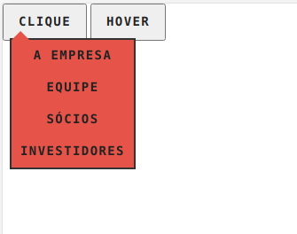

# Dropdown

Um dropdown feito com CSS/JavaScript puro, sendo reutilizável através de classes(ES6).

## Exemplo de Utilização

É necessário incluir os assets presentes na pasta **./dist**

**Imagem:**



**Código:**

```html
<button data-dropdown data-dropdown-hover>
  <a href="sobre.html">Hover</a>
  <ul class="dropdown-menu">
    <li><a href="empresa.html">A empresa</a></li>
    <li><a href="equipe.html">Equipe</a></li>
    <li><a href="socios.html">Sócios</a></li>
    <li><a href="investidores.html">Investidores</a></li>
  </ul>
</button>

<script>
  // Primeiro parâmetro: Seletor que indica os elementos
  // que contém dropdown
  const dropdownMenu = new DropdownMenu('[data-dropdown]');
  dropdownMenu.init();
</script>
```

## Testar Utilização

Para testar a utilização: É possível através do arquivo **./exemplo.html**

Para desenvolver: Utilize o arquivo **./index.html**

## Estilização

Para melhor capacidade de estilização, o CSS não está minificado, permitindo
ser customizado com facilidade.

Para modificar o estilo do dropdown, edite o estilo baixado da pasta **./dist**

## Funcionamento

O dropdown permite ser configurado em **dois estilos**:

- Abrir somente ao click
  - Basta colocar somente o dataset **[data-dropdown]** no dropdown

- Abrir ao hover/click
  - Colocar dois datasets no dropdown, o **[data-dropdown]** e **[data-dropdown-hover]**

**Ambos** os modelos possuem um **outsideClick**, um script que detecta o clique fora e
realiza o fechamento do dropdown.
